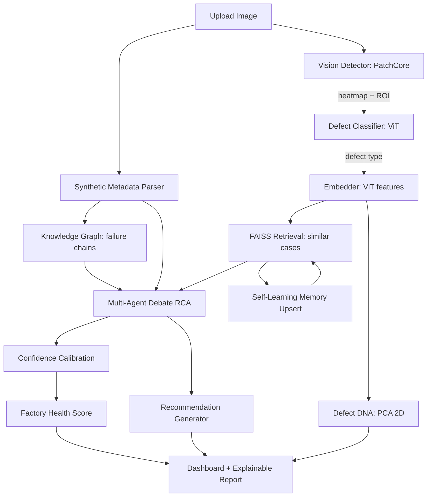

# ForgeMind — Autonomous Visual Manufacturing Intelligence System
### Architecture & Pipeline Specification (Hackathon AGIHUNTERS_PS2)

> **Project identity:** Not "an anomaly detector." An AI that reasons like a
> senior quality engineer. We compete on *intelligence*, not raw AUROC —
> MVTec AD is saturated (~99% image-AUROC for top methods), so the demo
> that wins is the one that *explains, predicts, and learns*, not the one
> with the highest pixel score.

---

## 0. What we BUILD vs what we DEFER

### MUST (the spine — build first, end-to-end)
1. **Vision Detector — PatchCore** → anomaly score + heatmap + cropped ROI
2. **Defect Classifier — ViT** (fine-tuned on MVTec/NEU/DAGM) → defect type
3. **FAISS Retrieval + Synthetic Factory Metadata** → historical cases
4. **Multi-Agent Debate RCA Engine** (local LLM Qwythos) → root cause
5. **Gradio Dashboard + Explainable Report**

### SHOULD (cheap "wow" — layer on top of the spine)
6. **Knowledge Graph** → similar failure chains
7. **Defect DNA** → PCA 2D embedding space
8. **Confidence Calibration** → decomposed sub-scores
9. **Factory Health Score** → aggregate risk
10. **Self-Learning Memory** → FAISS/KG upsert every inspection

### DEFER (only if spine ships)
- Vision LLM (Qwen2.5-VL) — we already have text Qwythos
- Defect Evolution Predictor (timeline sim)
- Counterfactual "what-if" analysis
- Autonomous investigation questions
- EfficientAD (secondary detector)

---

## 1. Tech Stack (our ACTUAL setup)

| Layer | Choice | Why |
|---|---|---|
| Compute | RTX A5000 24GB, CUDA 12.4 | torch cu124 |
| Vision detect | PatchCore (torchvision features) | SOTA, training-FREE |
| Classifier | ViT-B/16 fine-tuned | strong, fast on A5000 |
| Vector store | FAISS (CPU) | already installed |
| Graph | NetworkX + pyvis | failure chains |
| Orchestration | LangGraph | agent debate flow |
| LLM (local) | Qwythos-9B Q8_0 via Ollama @11434 | root-cause reasoning |
| Embeddings | ViT penultimate features | for FAISS + DNA |
| PCA | scikit-learn | Defect DNA |
| Dashboard | Gradio | interactive, fast |
| Storage | SQLite (v1) | defect_logs, metadata, memory |

---

## 2. The Pipeline — Stage Map



---

# PART 2 — TECHNICAL DEEP DIVE (for members with ZERO experience)

> Read this top-to-bottom. Each stage lists: **Goal / Inputs / Outputs /
> How it works / Minimal code / Rookie notes / Connects to.** Every "shape"
> note tells you the actual data type/size flowing between stages.

---

## STAGE 1 — Image Upload
**Goal:** Get a usable image into the pipeline.

**Inputs:** a file from disk or the dashboard (`*.png / *.jpg`).
**Outputs:** `img_pil: PIL.Image` (RGB), and `img_np: np.ndarray` of shape
`(H, W, 3)`, dtype `uint8`, values `0–255`.

**How it works:**
- Gradio gives you a temp file path. Load it with `PIL.Image.open(path).convert("RGB")`.
- Convert to a NumPy array for CV ops.
- **Two preprocess paths** (don't mix them):
  - **PatchCore** wants the *native* resolution feature map → just `ToTensor()`.
  - **ViT** wants `224×224` → `Resize((224,224))` then normalize with
    ImageNet mean/std `[0.485,0.456,0.406]` / `[0.229,0.224,0.225]`.

**Minimal code:**
```python
from PIL import Image
import numpy as np, torch
from torchvision import transforms

img_pil = Image.open(path).convert("RGB")
img_np  = np.array(img_pil)                      # (H,W,3) uint8

vit_tf = transforms.Compose([
    transforms.Resize((224,224)),
    transforms.ToTensor(),
    transforms.Normalize([0.485,0.456,0.406],[0.229,0.224,0.225]),
])
x_vit = vit_tf(img_pil).unsqueeze(0)             # (1,3,224,224) float
```

**Rookie notes:** keep `uint8` for display, `float tensor` for models.
Never feed a `uint8` straight into a model.
**Connects to:** Stage 2 (metadata) and Stage 3 (PatchCore) and Stage 4 (ViT).

---

## STAGE 2 — Synthetic Factory Metadata  *(ADDED)*
**Goal:** Give every image a believable factory context so root-cause
reasoning sounds real (we have no real sensor data).

**Inputs:** `filename: str`.
**Outputs:** `metadata: dict` with keys
`BatchID, Machine, Operator, Temperature, Humidity, Shift, Material,
Pressure, Supplier, MachineAge, LubricationHours`.

**How it works:**
- Hash the filename → use it as a **random seed**. Same file → same
  metadata every run (reproducible demo).
- Draw each field from a realistic range/distribution.

**Minimal code:**
```python
import random, hashlib

def make_metadata(filename):
    seed = int(hashlib.md5(filename.encode()).hexdigest(), 16) % (2**32)
    r = random.Random(seed)
    return {
        "BatchID": f"B{r:06d}",
        "Machine": r.choice(["M1","M2","M3","M4"]),
        "Operator": r.choice(["Op-A","Op-B","Op-C"]),
        "Temperature": round(r.uniform(20,80),1),     # °C
        "Humidity": round(r.uniform(30,90),1),        # %
        "Shift": r.choice(["A","B","C"]),
        "Material": r.choice(["Steel-58HRC","Al-40HRC","Ti-55HRC"]),
        "Pressure": round(r.uniform(1.0,6.0),2),      # bar
        "Supplier": r.choice(["Sup-A","Sup-B","Sup-C"]),
        "MachineAge": r.randint(1,15),                # years
        "LubricationHours": r.randint(0,500),
    }
```

**Rookie notes:** This is **simulated**. In the writeup call it a
"simulated factory data layer" — never claim it's real telemetry.
**Connects to:** Stage 7 (KG), Stage 8 (debate metadata agent), Stage 11 (health).

---

## STAGE 3 — Vision Detector: PatchCore  *(SPINE)*
**Goal:** Decide *if* there's a defect and *where* (heatmap + ROI).

**Inputs:** `img_tensor` (native res, `(1,3,H,W)` float).
**Outputs:**
- `anomaly_score: float` (e.g. `0.93`)
- `heatmap: np.ndarray (H,W)` float `0–1` (per-pixel abnormality)
- `roi: (x1,y1,x2,y2)` bounding box of the hottest region
- `roi_crop: PIL.Image` cropped region

**How it works (the actual algorithm):**
1. Load a **pretrained** CNN (no training): `wide_resnet50_1` or `resnet18`.
2. **Hook** an intermediate layer to capture the feature map. For a
   `224×224` input, `resnet18.layer2` gives a map of shape
   `(1, 512, 28, 28)` → 28×28 = **784 patch-vectors**, each 512-d.
3. **BUILD MEMORY BANK (once, on good images):** run every *normal* image,
   collect all patch-vectors, store in a big list `Mem` (shape
   `[N_patches, 512]`). Then **coreset subsample** (greedy k-center) to
   shrink it for speed. Save `Mem` to disk (`mem_bank.npy`).
4. **INFERENCE (per new image):** for each of its 784 test patches, compute
   the distance to its nearest memory patch (`min over Mem`). That gives a
   28×28 distance map → **upsample** to `H×W` → that's the `heatmap`.
   `anomaly_score = max(heatmap)`. ROI = bbox around the top region.

**Minimal code (inference side):**
```python
import torch, numpy as np, faiss

Mem = np.load("mem_bank.npy")               # (M,512) float32
index = faiss.IndexFlatL2(512); index.add(Mem)

def patchcore_score(feat_map):              # feat_map: (1,512,28,28)
    patches = feat_map[0].reshape(512,28*28).T   # (784,512)
    D, _ = index.search(patches.astype("float32"), 1)  # nearest dist
    dmap = D.reshape(28,28)                       # 28x28 distances
    heat = np.array(Image.fromarray(dmap).resize((H,W)))  # upsample
    heat = (heat-heat.min())/(heat.max()-heat.min())
    return float(heat.max()), heat
```

**Rookie notes:** PatchCore needs **no backprop / no training loop** —
that's why it's safe for 2 days. The only compute cost is the one-time
memory-bank build over the `good/` images. Use FAISS for the nearest
search (fast). The heatmap is just "how unlike normal is each pixel."
**Connects to:** Stage 4 (classify the ROI), Stage 8 (visual agent gets ROI+heatmap).

---

## STAGE 4 — Defect Classifier: ViT  *(SPINE)*
**Goal:** Name the defect type (crack / scratch / inclusion / dent / rust…).

**Inputs:** cropped `roi` or full `img_tensor` at `224×224`.
**Outputs:** `defect_type: str`, `class_confidence: float` (0–1).

**How it works:**
- Load `torchvision.models.vit_b_16(pretrained=True)`.
- Replace the head: `model.heads.head = nn.Linear(768, num_classes)`.
- **Fine-tune:** freeze the encoder, train only the head + last block.
  (Training the whole thing is slower and risks overfit — not needed.)
- Loss = `CrossEntropyLoss`, optimizer = `AdamW(lr=1e-4)`.
- After training, `torch.save(model.state_dict(), "vit_defect.pt")`.
- At inference: `out = model(x); prob = softmax(out); defect = argmax`.

**Minimal code:**
```python
from torchvision.models import vit_b_16
model = vit_b_16(pretrained=True)
model.heads.head = torch.nn.Linear(768, NUM_CLASSES)
# freeze all but head + last encoder block
for n,p in model.named_parameters():
    p.requires_grad = ("heads" in n) or ("encoder.layers.11" in n)
# training loop: for x,y in loader: opt.zero_grad(); loss=ce(model(x),y); loss.backward(); opt.step()
```

**Rookie notes:** `num_classes` = number of defect categories across
MVTec+NEU+DAGM combined (or per-dataset). `class_confidence = prob[argmax]`.
**Connects to:** Stage 5 (embedding), Stage 8 (debate visual agent).

---

## STAGE 5 — Embedder (ViT features)
**Goal:** Turn the image into one fixed-length vector for memory + DNA.

**Inputs:** same `224×224` tensor.
**Outputs:** `embedding: np.ndarray (768,)` float32.

**How it works:** Reuse the *same* ViT but **remove the head**. The
transformer outputs a `CLS` token vector of size 768 right before
classification — that's your embedding. Normalize it (L2) so FAISS
distances are meaningful.

**Minimal code:**
```python
emb_model = vit_b_16(pretrained=True); emb_model.heads = torch.nn.Identity()
with torch.no_grad():
    e = emb_model(x_vit).squeeze().cpu().numpy()   # (768,)
    e = e / np.linalg.norm(e)                       # L2 normalize
```

**Rookie notes:** Same network, two jobs (classify + embed). Don't load
it twice if RAM is tight — just call different parts.
**Connects to:** Stage 6 (FAISS), Stage 9 (DNA), Stage 12 (memory).

---

## STAGE 6 — FAISS Retrieval: similar cases  *(SPINE + metadata)*
**Goal:** "Have we seen something like this before?" → ground the LLM.

**Inputs:** `embedding (768,)` (L2-normalized), `k=5`.
**Outputs:** `top_k: list of case dicts` → each has
`{embedding_id, defect_type, metadata, past_rca_text, distance}`.

**How it works:**
- Maintain a FAISS index of all historical embeddings:
  `index = faiss.IndexFlatL2(768)` (or `IndexIVFFlat` for scale).
- On a new case call `D, I = index.search(q.reshape(1,-1), k)`.
  `I` = nearest IDs, `D` = distances. Map IDs → records stored in SQLite
  or a pickle list.

**Minimal code:**
```python
import faiss
index = faiss.IndexFlatL2(768)
# at setup: index.add(all_embeddings)   # (N,768)
D, I = index.search(e.reshape(1,-1), k=5)
cases = [case_db[i] for i in I[0]]      # pull stored records
```

**Rookie notes:** FAISS holds only the *vectors*. The *meaning* (metadata,
past RCA) lives in a parallel list/DB keyed by the same IDs.
**Connects to:** Stage 8 (history agent), Stage 12 (add new case).

---

## STAGE 7 — Knowledge Graph: failure chains  *(ADDED)*
**Goal:** Retrieve not similar *images* but similar *stories* (causal
chains: defect → cause → component → failure).

**Inputs:** `defect_type: str`, optionally `metadata`.
**Outputs:** `chains: list[list[str]]` e.g.
`["Scratch","Vibration","Bearing Wear","Motor Stress","Heat","Shutdown"]`.

**How it works:**
- Build a **directed graph** with `networkx.DiGraph()`.
- **Seed** it with domain rules (a static edge list you write by hand).
- **Enrich** over time: when the debate concludes a cause, add/ strengthen
  the edge `defect → cause`.
- Query: `nx.descendants(G, defect_type)` gives everything reachable →
  those are the plausible chains. Persist with `nx.write_gpickle(G, "kg.gpickle")`.
- Render for dashboard with `pyvis` (interactive HTML graph).

**Minimal code:**
```python
import networkx as nx
G = nx.DiGraph()
G.add_edge("Scratch","Vibration"); G.add_edge("Vibration","Bearing Wear")
# query
chains = [nx.shortest_path(G,"Scratch",t) for t in nx.descendants(G,"Scratch")]
```

**Rookie notes:** A graph is just dots + arrows. Don't overthink it. The
value is *visual* + gives the LLM structured context.
**Connects to:** Stage 8 (debate), Stage 14 (graph widget).

---

## STAGE 8 — Multi-Agent Debate RCA Engine  *(ADDED — core differentiator)*
**Goal:** Three specialist agents propose root causes; a moderator decides.

**Inputs:** `visual_ctx` (defect + heatmap summary + ROI), `history_ctx`
(top-k cases), `metadata`, `chains`.
**Outputs:** `rca: {winning_cause, rationale, votes:[{agent, cause, conf}]}`.

**How it works (LangGraph):**
- Define a `State` dict holding the contexts + an empty `votes` list.
- **3 node functions**, each builds a prompt and calls **Qwythos** via the
  OpenAI-compatible endpoint at `http://localhost:11434/v1`:
  - *Visual agent*: "You are a CV expert. Defect=X, heatmap says Y. Propose root cause + confidence 0–1."
  - *History agent*: "Past similar cases: … Propose root cause + confidence."
  - *Metadata agent*: "Factory context: temp=…, supplier=… Propose root cause + confidence."
- Each node appends its `{agent, cause, conf}` to `state["votes"]`.
- **Moderator node**: feeds all votes to Qwythos → "Which wins and why?"
  returns the final `rca`.

**Minimal code (one agent):**
```python
from openai import OpenAI
llm = OpenAI(base_url="http://localhost:11434/v1", api_key="ollama")
def visual_agent(state):
    prompt = f"You are CV expert. Defect:{state['defect']}. Heatmap:{state['heat_summary']}. Give JSON {{cause,conf}}."
    r = llm.chat.completions.create(model="qwythos",
        messages=[{"role":"user","content":prompt}], temperature=0.2)
    state["votes"].append(parse_json(r.choices[0].message.content))
    return state
# LangGraph: builder.add_node("visual", visual_agent) ... add_edge -> moderator
```

**Rookie notes:** The "debate" is 3 separate LLM calls + 1 moderator call
(local, free, fast). Each call returns text → parse JSON. Keep
`temperature` low (0.1–0.3) for stable JSON.
**Connects to:** Stage 10 (calibration), Stage 13 (recommendation).

---

## STAGE 9 — Defect DNA: PCA 2D  *(ADDED — cheap wow)*
**Goal:** A 2D scatter where each defect type forms a visible cluster.

**Inputs:** all stored embeddings `(N,768)` + the new one → `(N+1,768)`.
**Outputs:** `coords: (N+1,2)`; new case plotted as a live dot.

**How it works:**
- `PCA(n_components=2).fit_transform(embeddings)` squashes 768-d → 2-d
  while keeping the most variance. Points of the same defect land near
  each other → colored clusters.

**Minimal code:**
```python
from sklearn.decomposition import PCA
coords = PCA(2).fit_transform(np.vstack([all_emb, e]))  # (N+1,2)
```

**Rookie notes:** Pure dimensionality reduction. No labels needed for the
math; you just color by known `defect_type` for the picture.
**Connects to:** Stage 14 (scatter widget).

---

## STAGE 10 — Confidence Calibration  *(cheap wow)*
**Goal:** Show *where* confidence comes from, not one magic number.

**Inputs:** `class_conf`, FAISS `distances`, debate `votes`, metadata.
**Outputs:** `calibration: {visual, history, metadata, consensus, overall}`.

**How it works (simple, honest heuristics):**
- `visual` = `class_conf` (0–1) from ViT.
- `history` = `1 - normalized(mean(faiss_distances))` (closer past cases → higher).
- `metadata` = a small rule, e.g. `0.9 if Shift=='A' else 0.7` (placeholder; can be LLM-given).
- `consensus` = `1 - std([v.conf for v in votes])` (agents agree → high).
- `overall` = weighted mean, e.g. `0.3*visual+0.3*history+0.2*metadata+0.2*consensus`.

**Minimal code:**
```python
cal = {
  "visual": class_conf,
  "history": 1 - np.mean(faiss_D)/faiss_D.max(),
  "metadata": 0.9 if meta["Shift"]=="A" else 0.7,
  "consensus": 1 - np.std([v["conf"] for v in votes]),
}
cal["overall"] = 0.3*cal["visual"]+0.3*cal["history"]+0.2*cal["metadata"]+0.2*cal["consensus"]
```

**Rookie notes:** These are *transparent* numbers — judges see the logic.
Don't fake them to always be 0.99; realism sells.
**Connects to:** Stage 14 (bar widget).

---

## STAGE 11 — Factory Health Score  *(cheap wow)*
**Goal:** Whole-line view instead of one image.

**Inputs:** all `session_records` (defect, metadata, severity).
**Outputs:** `health: {factory_pct, by_machine:{}, by_supplier:{}, by_shift:{}}`.

**How it works:**
- Group records by `Machine` / `Supplier` / `Shift`.
- Compute anomaly rate per group = `defects / total`.
- `factory_pct = 100 * (1 - weighted_avg(anomaly_rates))`.

**Minimal code:**
```python
from collections import defaultdict
g = defaultdict(list)
for r in records: g[r["meta"]["Machine"]].append(r["is_defect"])
health = {m: 1 - sum(v)/len(v) for m,v in g.items()}   # per-machine health
factory_pct = 100 * sum(health.values())/len(health)
```

**Rookie notes:** Aggregation only — no ML. Pure pandas/groupby fodder.
**Connects to:** Stage 14 (gauges).

---

## STAGE 12 — Self-Learning Memory Update  *(ADDED)*
**Goal:** Every inspection makes the system smarter.

**Inputs:** `embedding`, `metadata`, `defect_type`, `rca`, optional human feedback.
**Outputs:** persistent updates to FAISS + KG + SQLite.

**How it works:**
- `index.add(embedding.reshape(1,-1))` → future retrievals include it.
- `case_db.append({...})` (parallel to FAISS IDs).
- `KG.add_edge(defect_type, rca.cause)` → strengthens chains.
- `sqlite: INSERT` the full record for audits.
- **Optional feedback loop:** if a human marks RCA wrong, store a penalty
  that lowers `consensus` weight next time.

**Minimal code:**
```python
index.add(e.reshape(1,-1)); case_db.append(record)
G.add_edge(defect_type, rca["winning_cause"])
cur.execute("INSERT INTO cases VALUES (?,?,?,?)", (defect_type, json.dumps(meta), rca_text, ts))
```

**Rookie notes:** This is the "it learns" story. Cheap to implement, huge
demo value. Just don't skip the SQLite row or you lose audit trail.
**Connects to:** Stage 6 (future retrievals), Stage 7 (future chains).

---

## STAGE 13 — Recommendation Generator
**Goal:** Actionable next step, not just a label.

**Inputs:** `rca`, `chains`, `metadata`.
**Outputs:** `recommendation: str` (1–3 concrete actions).

**How it works:** Folded into the **moderator** prompt (Stage 8):
"Also output 1–3 maintenance actions referencing the failure chain and
machine/supplier from metadata (e.g., 'Inspect Heat Furnace 4 → Temp
Controller → Cooling Line B')." Parse the actions list from the JSON.

**Minimal code:**
```python
mod_prompt += " Also return 'actions':[<string>] of 1-3 concrete steps."
# parse rca["actions"]
```

**Rookie notes:** The LLM does the wording; you just template it.
**Connects to:** Stage 14 (text block).

---

## STAGE 14 — Dashboard + Explainable Report  *(SPINE)*
**Goal:** One screen telling the whole story + a downloadable report.

**Inputs:** outputs of Stages 3–13.
**Outputs:** interactive Gradio UI + PDF/text report file.

**How it works (Gradio Blocks):**
- `gr.Image` for uploaded image + heatmap overlay (draw heatmap with
  `matplotlib` or blend via PIL).
- `gr.Image` for ROI crop.
- `gr.Gallery` for top-k retrieved cases.
- `pyvis` HTML for the KG graph (embed via `gr.HTML`).
- `gr.ScatterPlot` or matplotlib for Defect DNA.
- `gr.BarPlot` for calibration; gauges for health.
- `gr.Textbox` for RCA rationale + recommendations.
- `gr.DownloadButton` to save the report (assemble a markdown/txt string).

**Minimal skeleton:**
```python
import gradio as gr
with gr.Blocks() as demo:
    img = gr.Image(label="Upload")
    heat = gr.Image(label="Heatmap")
    out = gr.Textbox(label="Root Cause + Recommendation")
    img.upload(fn=pipeline_run, inputs=img, outputs=[heat, out])
demo.launch(server_port=7860)
```

**Rookie notes:** Gradio needs no frontend. One Python file = full UI.
Test `pipeline_run` standalone first, then wire the button.
**Connects to:** everything (it's the surface).

---

## 3. End-to-End Data Flow (per inspection)

```
image
  ├─> metadata (synthetic)          [2]
  ├─> PatchCore -> heatmap + ROI    [3]
  ├─> ViT -> defect_type            [4]
  ├─> ViT features -> embedding     [5]
  ├─> FAISS -> past cases           [6]
  ├─> KG -> failure chains          [7]
  ├─> Debate (Visual+History+Meta)  [8]
  ├─> PCA DNA point                 [9]
  ├─> Confidence calibration        [10]
  ├─> Factory health update         [11]
  ├─> Memory upsert (FAISS+KG)      [12]
  ├─> Recommendation                [13]
  └─> Dashboard + Report            [14]
```

---

## 4. Module → File Map (for scaffolding)

| Module | File (planned) |
|---|---|
| Data loaders | `data/loaders.py` |
| Synthetic metadata | `data/metadata.py` |
| PatchCore detector | `models/patchcore.py` |
| ViT classifier | `models/vit_classifier.py` |
| Embedder | `models/embedder.py` |
| FAISS store | `storage/faiss_store.py` |
| Knowledge graph | `storage/knowledge_graph.py` |
| Debate agents | `agents/debate.py` |
| RCA moderator | `agents/moderator.py` |
| Defect DNA | `analytics/dna_pca.py` |
| Calibration | `analytics/calibration.py` |
| Health score | `analytics/health.py` |
| Dashboard | `dashboard/app.py` |
| Orchestrator | `pipeline/run.py` (LangGraph) |

---

## 5. Training Plan (what runs on the GPU)

1. **PatchCore memory bank** — feed MVTec `good/` images once (~minutes, no
   backprop). Save coreset.
2. **ViT fine-tune** — train head+last layers on labeled defects
   (MVTec/NEU/DAGM) for a few epochs (~1–2h on A5000).
3. Everything else is **inference / CPU / local-LLM** — no training.

---

## 6. Honesty Caveats (keep in the final writeup)
- Synthetic metadata, failure-chain sim, and debate are **demo theater**
  that wins judges — but describe them as *simulated/supporting layers*,
  not real predictive modeling.
- The LLM (Qwythos) reasons over text only; it never "sees" the raw image.
  We feed it the heatmap ROI description + defect type + metadata + retrieved
  cases. That is enough.
- Compete on **intelligence & explainability**, not a marginally higher
  AUROC. That is the whole point of ForgeMind.
